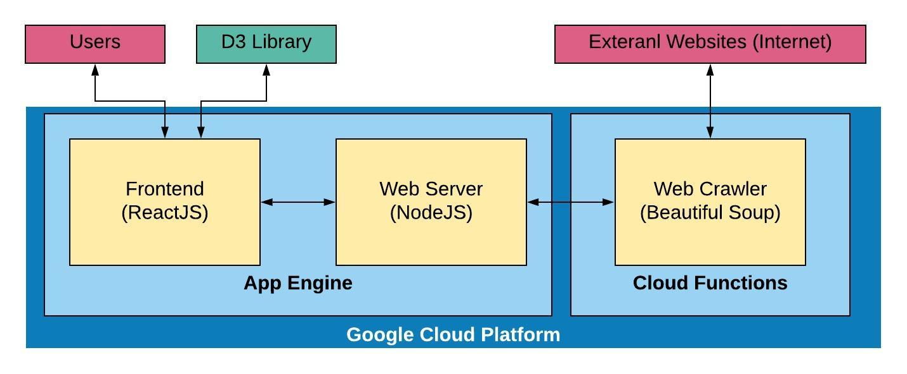
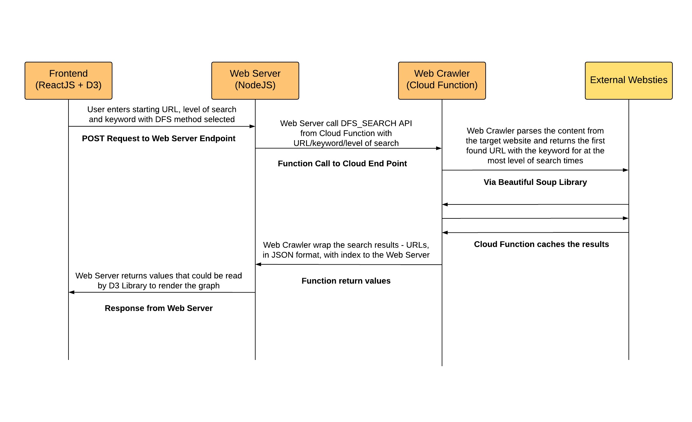
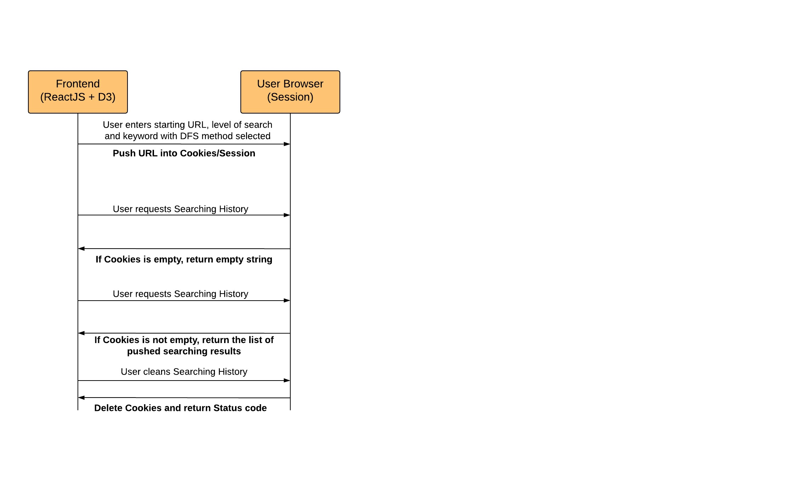

# Web_Crawler_CS467

This is the workspace for CS 467 Capstone Software Projects.

---

## Project Plan

### TODO Items

- [ ] Decide a `Team Name`

- [X] Add `User Stories`: Overall Requirements for the project

- [ ] `Specification`: About how to implment those user stories

- [ ] Add `Prototype`: At least two graphical examples that demonstrate a page, chart, board, level, flowchart, or layout.

- [X] Add `Architecture` - High Level: A description of your initial thoughts on the structure of the software

- [X] Add `Use Cases` and `Message Sequence Chart`: A description of what your program does from the user's perspective.

- [ ] Add `APIs list` for both Web Backend and Web Crawler Server

> -> Web Server: GET/POST Request || Web Crawler: getDFSData and getBFSData 

- [ ] Add `Technologies Chosen` and `Development tools`: An initial listing of which software libraries, languages, development tools, and other systems will be required to create and use the software.

- [ ] Add `Learning Materials and Question`: List all possible questions for the specific technologies and learning goal in the first two weeks

> -> Collect Questions such as: How to call Google Cloud Function through NodeJS backend web server?

- [ ] Add `Division of Work`: A thorough and complete description of what each Team member will be accomplishing, including who will produce each type of documentation needed (see the Mid-Point and Final Report assignments for more).

> -> Decide the work between **Crawler Developer**, **Data Transfer/Web Backend Developer**, **DevOps**, **FrontEnd Developer** and **Data Visualizer**

- [ ] Add `Plan and Schedule`: A list that describes how much time each Team member will be spending on their portion of the Project. The amount spent per Team member must be roughly equivalent and should be at least 100 hours each. Expand the Project accordingly to make the work amounts equivalent, and make sure the Project is sufficiently complex.

> -> 15 hours/week at least

- [ ] Add `Results` and `Conclusion`

---

## User Stories

### Frontend
- As a user, I can see the instruction to use this website
- As a user, I can see a form to enter all required information to start crawling
- As a user, I can enter a starting web page into the search bar
- As a user, I can select the method of traversal between BFS/DFS
- As a user, I can enter a numeric limit that stops the crawl from continuing indefinitely
- As a user, I can press the “Crawl” button to start crawling
- As a user, I can enter a keyword (optional)
- As a user, I can see a graph representing the crawling results 
- As a user, I can see a spinner while waiting for the crawling result
- As a user, I should be informed if I enter an invalid input
- As a user, I can see the searching history
- As a user, I can clear the search history
- As a user, I can see the error messages from Web Server (e.g. Timeout, No Result)
- As a user, within the graph, I can hover over the node and see the web page title
- As a user, within the graph, I can hover over the node and see the web page URL
- As a user, within the graph, I can access the web page opened in a new tab
- As a user, within the graph, I can modify the size of the graph  
- As a Web Frontend, it should be a single web application
- As a Web Frontend, it can validate the user input not to be empty
- As a Web Frontend, it can validate the user input should be a valid URL
- As a Web Frontend, it can validate the user input by the limitation of DFS/BFS
- As a Web Frontend, it can transmit the user input to a web server through the request header/body
- As a Web Frontend, it can display the crawling result including the title and URL of each page, perhaps
- As a Web Frontend, it can control the crawling result graph in such a way - As to appear only when the user hovers over them to conserve space
- As a Web Frontend, the graph should be able to zoom in/out
- As a Web Frontend, it can handle the graph node and lines not being overlapped and using an arrow to connect each node
- As a Web Frontend, it can differentiate the node color by the domain name
- As a Web Frontend, it can render the whole graph and animation using D3 libraries
- As a Web Frontend, it can store past starting pages on the user’s computer that can be displayed and restarted
It needs more discussion of how to display the graph and what manipulations are allowed to be done by the user.

### Web Server
- As a Web Server, it can receive the request from Web Frontend
- As a Web Server, it can communication with the end points from Cloud Function and access APIs for both BFS and DFS crawling
- As a Web Server, it can parse the request and call the correct DFS/BFS API from Google Cloud Platform (Cloud Function Service)
- As a Web Server, it can parse the request and attach the keyword and level of search into DFS/BFS API from Google Cloud Platform (Cloud Function Service)
- As a Web Server, it can receive the response from Cloud Function.
- As a Web Server, it can return the content from Cloud Function to the Web Frontend
- As a Web Server, it should response Error Message with correct Status Code to the Frontend.
- As a Web Server, it should be hosted on the Google Cloud Platform
- As a Web Server, it should be accessed by the end point of Google App Engine. (e.g. https://XXXX.appspot.com/)
   
### Web Crawler

- As a Web Crawler, it should be hosted on the Google Cloud Platform
- As a Web Crawler, it should expose two APIs (DFS/BFS) from cloud function
- As a Web Crawler, it can receive the function parameters from Web Server
- As a Web Crawler, it can parse the parameters like URL, level of search, search method and keyword
- As a Web Crawler, it should scrape the URL and capture the first URL from the crawling results (if there is a keyword, captures the first URL with keyword)
- As a Web Crawler, it can implement both DFS and BFS algorithm to collect URLs
- As a Web Crawler, to aply the DFS algorithm, the program will start at the start page, randomly choose one of the links on that page, then follow it to the next page. Then, on the next page, it randomly selects a link from the options available and follows it. This makes a chain from the starting page. This continues until the program hits the page limit indicated.
- As a Web Crawler, to apply the BFS algorithm, the program will follow ALL links from the start page, and ALL links from each page it visits, until the crawler h- As reached the limit of pages deep, it should visit. 
- As a Web Crawler, it should limit the number of levels for the BFS method, since this is likely to return a huge, sprawling graph, consider limiting the user's input with this kind of search to a small number. 
- As a Web Crawler, it should return a JSON data representing the Search Result to Web Server.

---
## Software Architecture

[Edit Link - SOFTWARE ARCHITECTURE](https://www.lucidchart.com/invitations/accept/bcf4be58-dd18-4547-a91b-235616250e4c)

---

## Use Cases

### Use Case 1 - User request to Crawl URLs

1. Enter a Starting URL 
2. Select between BFS and DFS crawling method
3. Select the depth of the searching level
4. Optional to enter a keyword
5. Press the Crawl button
6. Web Frontend sends the request to Web Server through POST Request
7. Web server receives JSON format request carrying user input in the request body
8. Web server calls the Web crawler hosting on GCP with the required information
9. Web Crawler crawls those URLs using BFS/DFS
10. Web Crawler wraps the list of URL into JSON format and returns to the Web server
11. Web Server parses the response and converts it to JSON format which could be read by Web Frontend
12. Web Frontend render contents using D3 libraries

[Edit Link - Use Case 1 - Crawling](https://www.lucidchart.com/invitations/accept/0676e765-79f8-4764-bb19-c7928544be8b)

### Use Case 2 - Searching History

1. User Enters starting URL, level of search and keyword with DFS method selected
2. After pressing crawl, Frontend pushes URL into the Cookies first and then start the process communicating with Web Server
3. User requests for the Searching History, then the Frontend request from the Cookies
4. If Cookies is empty, Frontend will display an empty list of searching History and inform the user there is no history
5. If Cookies is not empty, Frontend captures a list of data to display in UI
6. User request to clean Searching History
7. Frontend calls the cleanup method to delete Cookies and return the status code of successfully removed data
8. Frontend display the empty list likes step 4.

[Edit Link - Use Case 2 - History ](https://www.lucidchart.com/invitations/accept/1357110e-049d-4016-93ba-e5fe29a18fdb)

---

### Project Plan Grading Standard

To earn full credit for this asignment, please submit a PDF that clearly includes the following items:

- [X] A description of what your program does from the user's perspective.
 
- [X] A description of your initial thoughts on the structure of the software.

- [ ] An initial listing of which software libraries, languages, APIs, development tools, servers, and other systems will be required to create and use the software.

- [ ] A thorough and complete description of what each Team member will be accomplishing, including who will produce each type of documentation needed (see the Mid-Point and Final Report assignments for more).

- [ ] A list that describes how much time each Team member will be spending on their portion of the Project. The amount spent per Team member must be roughly equivalent and should be at least 100 hours each. Expand the Project accordingly to make the work amounts equivalent, and make sure the Project is sufficiently complex.

- [ ] At least two graphical examples that demonstrate a page, chart, board, level, flowchart, or layout.

- [ ] An introduction and a conclusion.

- [ ] Make sure the Dev Team name (e.g. "Alpha") is in the filename of the .PDF you submit and in the body of the Plan. Also include the Team member's names in the body of the Plan.

---

## Future Tasks

### Mid-Point Project Check

For this assignment, after several weeks of development, you must submit `something functional`. 

There are two things required here:

- Functional code that might be buggy and will be incomplete. In the case of web or online server-based projects, you must also submit a `URL/instructions describing where to go to see your already-hosted project`. For other projects that are not hosted online, include compilation instructions, as needed.

- Instructions on how to examine, use, play with, visit, and/or manipulate your project, and what highlights should be looked for.

A grade will be assigned (for this assignment) based on subjective analysis of how much work has been accomplished and how impressive it is so far. You will not be judged on your instructions based on their quality, but on how well they describe how to examine what you've done. Make them clear and easy to follow! Look at this example from a previous term for a good idea of what to do.

---

### Create Final Report

Your text report must consist of the following complete and thorough features, each of which is worth up to 7 points each:

- A description of what your program does from the user's perspective.

- Clear usage instructions, including at least two graphical examples of some element of your project. Remember to include URLs that should be visited or compilation instructions, as necessary.

- A description of how the software and systems function together.

- A listing of which software libraries, languages, APIs, development tools, servers, and other systems you used to create the software, and deeper discussions of any of those you want to talk more about.

- A description of what each Team member accomplished.

- An introduction and closing sections.

If your project has majorly deviated from your Project plan (which is ok!), include a section detailing the reasons and outcome.

Reports must be a `minimum of 8 pages` to receive full points. See here for a great example, and one of my favorite projects.

Write this report as if someone reading it has not yet used your software, or perhaps never will (i.e., this report is separate and distinct from your project). A grade for this assignment will be given based on subjective analysis of the quality and thoroughness of your report in regards to the above sections.

---

### Create Poster

Your poster must include the following:

- Your team member's names
- A simple prose description of what your project does
- At least one screenshot showing your code
- At least one screenshot of your project in action

Consider including the following optional elements:

- Flow charts and other design graphics
- Pictures of your team members (especially if you are planning on coming to the Career Showcase)
- Bullet points highlighting interesting features and examples

Remember: all images in the poster should be high resolution.

