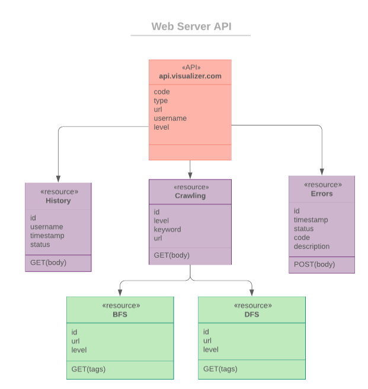

# Web_Crawler_CS467

This is the workspace for CS 467 Capstone Software Projects.

---

## Project Instruction

Open the zip folder or clone the project from the GitHub Repository:

```
$git clone https://github.com/WeiChienHsu/Web_Crawler_CS467.git
```

Please make sure you have downloaded and installed `node`, `python3`, and `npm` in your local machine. 

- You can install npm by installing Node.js. Node.js is an environment for developing server-side applications. 
- When you install Node.js, npm will install automatically. (https://nodejs.org/en/)


### Frontend UI

> Under the directory: `./Web_Crawler_CS467/webapp/react-front-end`

Run:

```
$npm install
$npm start
```

to install the required modules and the server will be listening on the `port 3000`

#### Test on local machine

Open your web browser and visit: http://localhost:3000/.

1. Enter a Starting URL 
2. Select between BFS and DFS crawling method
3. Select the depth of the searching level
4. It is optional to enter a keyword
5. Press "Search" or "Demo" Button
6. Web Frontend sends the request to Web Server through a POST Request
7. Web Frontend receives the crawling result from the Web Server and renders content to a chart using D3 libraries
8. If there is Error Message return from the Web Server, it will display on the UI.

#### Some good testing examples:
|Algo | URL | depth | keyword |
|:--:|:---:|:---:|:---:|
|BFS | www.google.com | 1 | mail|
|BFS | www.google.com | 1 | mail|
|DFS | https://www.reddit.com/r/OSUOnlineCS/ | 22 | - |
|DFS | https://yahoo.com | 16 | - |


### Web Server

> Under the directory: `./Web_Crawler_CS467/webapp`

#### Run on local machine

Run:

```
$npm install
$npm start
```

to install the required modules and the server will be listening on the **port 8080**

#### Test on local machine

In the web app directory, you will also find a directory called ‘testing’ with two files to create the testing setup for the postman. 

You can import both
- visualizers_api.postman_collection.json
- visualizers_api.postman_environment.json

Currently, the `app_url variable` is set to the cloud deploy API if you would like the code running in your local machine you will have to change this value to `http://localhost:8080`


### Web Crawler

> Under the directory: `./Web_Crawler_CS467`

To see the algorithms in action with live URLs being printed, run locally with these instructions.

1. Install the codebase in our Github repository

2. Make sure you have the appropriate python packages installed from our requirements.txt file (Python 3) using:

```cmd
pip3 install -r requirements.txt
```

3. Run the algorithm of your choice from the target file’s directory, in the following format:

**BFS** - `python3 bfs_search.py [target url] [depth] [keyword (optional)]`

```
python3 bfs_search.py http://www.google.com 2
python3 bfs_search.py http://www.google.com 2 stop
```

**DFS** - `python3 dfs_search.py [target url] [depth] [keyword (optional)]`

```
python3 dfs_search.py http://www.google.com 20
python3 dfs_search.py http://www.google.com 20 stop
```

4. Watch as each URL is printed to the console and it is added to the list to be returned (in this case printed) as one large array object


---


## Project Plan

### USER STORIES AND SPECIFICATION

#### Frontend

- [X] As a user, I can see the instruction to use this website: When arriving to the main page there will be text and/or a diagram to explain how to use the crawler

- [X] As a user, I can see a form to enter all required information to start crawling: The homepage will display a web form in the UI that requests the type of search to be performed, the depth of the search, and the starting web page

- [X] As a user, I can enter a starting web page into the search bar: The starting web page input will require a valid URL as an entry

- [X] As a user, I can select the method of traversal between BFS/DFS: The method of traversal between BFS/DFS will be selected via radio button

- [X] As a user, I can enter a numeric limit that stops the crawl from continuing indefinitely: The number of traversals will be a drop down of integers that are available options for that form of traversal

- [X] As a user, I can press the “Crawl” button to start crawling: The submit button will have the text “crawl”, which when pushed will call the server API (endpoint dependent on search type) to start the search process

- [X] As a user, I can enter a keyword (optional): The UI will have an optional box to enter a stopping keyword.

- [X] As a user, I can see a graph representing the crawling results: The UI will use the D3 library to display a web-style graph that shows the various web pages that were hit by the crawler.

- [X] As a user, I can see a spinner while waiting for the crawling result: While performing the algorithm on the backend, the UI will display a spinning indicator that says “Crawling…” until the response is received

- [X] As a user, I should be informed if I enter an invalid input

- [X] As a user, I can see the searching history: The search history will be stored as cookies in the user’s browser

- [X] As a user, I can clear the search history: There will be a button that will clear the user’s search history

- [X] As a user, I can see the error messages from Web Server (e.g. Timeout, No Result): If the web server experiences an error, the messaging will be displayed to the user as well as a prompt to please try again

- [X] As a user, within the graph, I can hover over the node and see the web page title/web page URL: Hovering over a node in the graph will show the web page title and URL for that corresponding node.

- [X] As a user, within the graph, I can access the web page opened in a new tab

- [X] As a user, within the graph, I can modify the size of the graph: There will be button options to zoom in or out of the graph to look closer at each node and its contents

- [X] As a Web Frontend, it should be a single web application

- [X] As a Web Frontend, it can validate the user input not to be empty: The UI will display an error message if the URL entered was empty or not valid input

- [X] As a Web Frontend, it can validate the user input should be a valid URL: URL validity will be determined using a regular expression check

- [X] As a Web Frontend, it can validate the user input by the limitation of DFS/BFS

- [X] As a Web Frontend, it can transmit the user input to a web server through the request header/body: The web page will send the given information in the req body to the web server

- [X] As a Web Frontend, it can display the crawling result including the title and URL of each page: After receiving a JSON response from the server, the front end will dissect the object to extract the relational and URL information.

- [X] As a Web Frontend, it can control the crawling result graph in such a way as to appear only when the user  hovers over them to conserve space

- [X] As a Web Frontend, the graph should be able to zoom in/out

- [X] As a Web Frontend, it can handle the graph node and lines not being overlapped and using an arrow to connect each node

- [X] As a Web Frontend, it can differentiate the node color by the domain name: Nodes will be colored by domain

- [X] As a Web Frontend, it can render the whole graph and animation using D3 libraries

---

#### Web Server

- [X] As a Web Server, it can receive the request from Web Frontend: The server will listen for any API requests from the front end. 

- [X] As a Web Server, it can establish communication with the endpoints from Cloud Function and access APIs for both BFS and DFS crawling: The server will determine whether the request is a BFS or DFS search based on the payload from the frontend: The server will make the appropriate function call to the backend cloud function.

- [X] As a Web Server, it can parse the request and attach the keyword and level of search into DFS/BFS API from Google Cloud Platform (Cloud Function Service): The server can parse the level and the keyword (if any) from the request to send to the cloud function for crawling

- [X] As a Web Server, it can receive the response from Cloud Function: The server will wait for a response from the cloud function after its API call 

- [X] As a Web Server, it can return the content from Cloud Function to the Web Frontend: The server will relay the information in JSON back to the frontend as the response to the original API call.

- [X] As a Web Server, it should response Error Message with correct Status Code to the Frontend: The server will identify any empty response object and return an error to the front end instead of the normal response. The server will have a fail safe, where if it take the function too long to respond, it will return an error message to the front end (in case there is an issue with the function that can not be assessed).

- [X] As a Web Server, it should be hosted on the Google Cloud Platform: The server will be hosted on Google Cloud Platform which in turn will host the front end of our webpage. It should be accessed by the end point of Google App Engine. (e.g. https://XXXX.appspot.com/)

---

#### Web Crawler

- [X] As a Web Crawler, it should expose two APIs (DFS/BFS) from cloud function: The crawler will be hosted in the cloud 


- [X] As a Web Crawler, it can receive the function parameters from Web Server: The crawler will have 2 separate functions for performing the search. One will implement the DFS algorithm and the other will implement the BFS algorithm.

- [X] As a Web Crawler, it can parse the parameters like URL, level of search, search method and keyword: The function parameters for starting URL, depth and keyword should be included from the server and The crawler will have a function to parse the parameters of URL, level of search,  and keyword out of the payload

- [X] As a Web Crawler, it should scrape the URL and capture the first URL from the crawling results: The crawler will scrape the page of the given URL until it finds another URL to jump to

- [X] As a Web Crawler, it can implement both DFS and BFS algorithm to collect URLs: The crawler should have 2 endpoints available, one for a DFS and one for BFS. If the keyword is found the search will stop and return a boolean indicating the keyword has been found instead of reaching the depth

- [X] As a Web Crawler, to apply the DFS algorithm, the program will start at the start page, randomly choose one of the links on that page, then follow it to the next page. Then, on the next page, it randomly selects a link from the options available and follows it. This makes a chain from the starting page. This continues until the program hits the page limit indicated.

- [X] As a Web Crawler, to apply the BFS algorithm, the program will follow ALL links from the start page, and ALL links from each page it visits, until the crawler has reached the limit of pages deep (as measured from the start page), it should visit. 

- [X] As a Web Crawler, it should limit the number of levels for the BFS method, since this is likely to return a huge, sprawling graph, consider limiting the user's input with this kind of search to a small number. 

- [X] As a Web Crawler, it should return a JSON data representing the Search Result to Web Server: The crawler will store its traversals (edges) in a data structure, as well as the URL followed, and the webpage title for each stop. There will be a function that converts the data structure information into a properly formatted JSON object. The crawler will return an empty object if an issue is encountered


---

## Software Architecture


[Edit Link - SOFTWARE ARCHITECTURE](https://www.lucidchart.com/invitations/accept/bcf4be58-dd18-4547-a91b-235616250e4c)


### Frontend React Components


### Web Server API



[Edit Link - Web Server API](https://www.lucidchart.com/documents/edit/5827111b-88cb-4b16-b338-a9f012bed4d2/0?callback=close&name=docs&callback_type=back&v=703&s=612)

---

## Use Cases

### Use Case 1 - User request to Crawl URLs


1. Enter a Starting URL 
2. Select between BFS and DFS crawling method
3. Select the depth of the searching level
4. Optional to enter a keyword
5. Press the Crawl button
6. Web Frontend sends the request to Web Server through POST Request
7. Web server receives JSON format request carrying user input in the request body
8. Web server calls the Web crawler hosting on GCP with the required information
9. Web Crawler crawls those URLs using BFS/DFS
10. Web Crawler wraps the list of URL into JSON format and returns to the Web server
11. Web Server parses the response and converts it to JSON format which could be read by Web Frontend
12. Web Frontend render contents using D3 libraries

[Edit Link - Use Case 1 - Crawling](https://www.lucidchart.com/invitations/accept/0676e765-79f8-4764-bb19-c7928544be8b)

### Use Case 2 - Searching History


1. User Enters starting URL, level of search and keyword with DFS method selected
2. After pressing crawl, Frontend pushes URL into the Cookies first and then start the process communicating with Web Server
3. User requests for the Searching History, then the Frontend request from the Cookies
4. If Cookies is empty, Frontend will display an empty list of searching History and inform the user there is no history
5. If Cookies is not empty, Frontend captures a list of data to display in UI
6. User request to clean Searching History
7. Frontend calls the cleanup method to delete Cookies and return the status code of successfully removed data
8. Frontend display the empty list likes step 4.

[Edit Link - Use Case 2 - History ](https://www.lucidchart.com/invitations/accept/1357110e-049d-4016-93ba-e5fe29a18fdb)